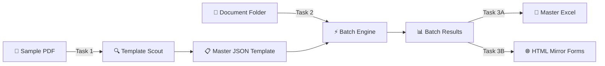
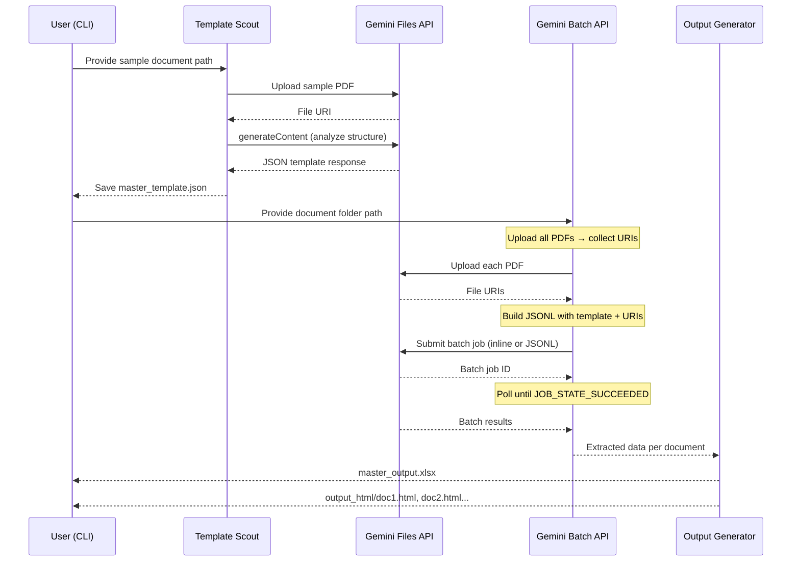

# Extractly — Step-by-Step Implementation Plan

> **Goal:** Build a Python 3.12 CLI utility that uses the Gemini Files API and Batch API to automate high-volume data extraction from structurally similar documents, producing a Master Excel Sheet and individual HTML Mirror Forms.

---

## High-Level Architecture



## Data Flow (Step by Step)



---

## Project Structure (Final State)

```
Extractly/
├── src/
│   └── extractly/
│       ├── __init__.py              # Package marker
│       ├── main.py                  # CLI entry point (Typer)
│       ├── config.py                # Settings via pydantic-settings
│       ├── models/
│       │   ├── __init__.py
│       │   └── template.py          # Pydantic models: Section, Field, MasterTemplate
│       ├── services/
│       │   ├── __init__.py
│       │   ├── template_scout.py    # Task 1: structural discovery
│       │   ├── batch_engine.py      # Task 2: batch extraction
│       │   ├── excel_writer.py      # Task 3A: Excel output
│       │   └── html_writer.py       # Task 3B: HTML mirror forms
│       └── clients/
│           ├── __init__.py
│           └── gemini_client.py     # Thin wrapper around google-genai SDK
├── tests/
│   ├── unit/
│   │   ├── test_template_scout.py
│   │   ├── test_batch_engine.py
│   │   ├── test_excel_writer.py
│   │   ├── test_html_writer.py
│   │   ├── test_gemini_client.py
│   │   └── test_models.py
│   ├── integration/
│   │   └── test_end_to_end.py
│   └── conftest.py                  # Shared fixtures
├── input_docs/                      # User's documents go here
├── output/                          # Generated outputs go here
├── pyproject.toml                   # Dependencies + metadata
├── .env.example                     # Template for env vars
├── .env                             # Actual secrets (git-ignored)
├── .gitignore
├── Makefile                         # make run, make test, make lint
└── README.md
```

---

## Open Questions

> [!IMPORTANT]
> Please clarify these before we begin coding:

1. **Document type**: Your `input_docs/` folder has a `Raloxifene_Master_Sample.pdf`. Are all target documents **PDFs only**, or could there be images (PNG/JPEG) of scanned documents too?

2. **Batch strategy — inline vs JSONL**: The Gemini Batch API offers two modes:
   - **Inline requests** (up to ~20MB total, simpler, results come back inline) — good for ≤50 documents
   - **JSONL file upload** (up to 2GB, results in a downloadable file) — good for hundreds of documents
   
   **Which scale are you targeting?** If unsure, I'll implement both and auto-select based on document count.

3. **Gemini model**: The SRS doesn't specify a model. I recommend `gemini-2.5-flash` (cost-effective, fast, excellent for document understanding). Should I use this, or do you prefer a different model?

4. **Excel library**: `openpyxl` is the standard for `.xlsx` files. Shall I use that, or do you prefer CSV output instead?

---

## Proposed Changes — Phase by Phase

Each phase is a self-contained unit you can run, test, and understand before moving to the next. **You drive — I build on your signal.**

---

### Phase 1: Project Scaffolding & Configuration

> **What you'll learn:** How to set up a modern Python project with proper dependency management, environment configuration, and a clean package structure.

#### [NEW] [pyproject.toml](file:///c:/Users/admin/OneDrive/Documents/Rasayan%20Labs%20Tasks/code/Extractly/pyproject.toml)
- Project metadata, Python 3.12 requirement
- Runtime dependencies: `google-genai`, `pydantic`, `pydantic-settings`, `openpyxl`, `typer`
- Dev dependencies: `pytest`, `pytest-cov`, `ruff`, `mypy`

#### [NEW] [.env.example](file:///c:/Users/admin/OneDrive/Documents/Rasayan%20Labs%20Tasks/code/Extractly/.env.example)
- Documents `GEMINI_API_KEY` and optional config vars (`GEMINI_MODEL`, `INPUT_DIR`, `OUTPUT_DIR`)

#### [NEW] [Makefile](file:///c:/Users/admin/OneDrive/Documents/Rasayan%20Labs%20Tasks/code/Extractly/Makefile)
- `make install`, `make test`, `make lint`, `make run`

#### [NEW] [src/extractly/__init__.py](file:///c:/Users/admin/OneDrive/Documents/Rasayan%20Labs%20Tasks/code/Extractly/src/extractly/__init__.py)
- Package marker

#### [NEW] [src/extractly/config.py](file:///c:/Users/admin/OneDrive/Documents/Rasayan%20Labs%20Tasks/code/Extractly/src/extractly/config.py)
- `Settings` class using `pydantic-settings` with `BaseSettings`
- Loads `GEMINI_API_KEY`, `GEMINI_MODEL` (default: `gemini-2.5-flash`), `INPUT_DIR`, `OUTPUT_DIR`
- Single `settings` instance exported as module-level singleton

**🧪 Tests:** Verify settings load from `.env`, test defaults, test missing API key raises error

---

### Phase 2: Data Models (The Blueprint)

> **What you'll learn:** How Pydantic models define the "shape" of data flowing through the system — the Master JSON Template structure.

#### [NEW] [src/extractly/models/template.py](file:///c:/Users/admin/OneDrive/Documents/Rasayan%20Labs%20Tasks/code/Extractly/src/extractly/models/template.py)

Three simple Pydantic models:

```python
class Field(BaseModel):
    """A single data field found in a document section."""
    label: str          # e.g., "Patient Name", "Batch Number"
    field_type: str     # e.g., "text", "date", "number"

class Section(BaseModel):
    """A logical group of fields in the document."""
    name: str           # e.g., "Header", "Shipping Information"
    fields: list[Field]

class MasterTemplate(BaseModel):
    """The complete structural map of a document type."""
    document_type: str          # e.g., "Certificate of Analysis"
    sections: list[Section]
```

#### [NEW] [src/extractly/models/extraction.py](file:///c:/Users/admin/OneDrive/Documents/Rasayan%20Labs%20Tasks/code/Extractly/src/extractly/models/extraction.py)

```python
class ExtractedDocument(BaseModel):
    """Data extracted from a single document, following the template."""
    source_filename: str
    sections: list[ExtractedSection]

class ExtractedSection(BaseModel):
    """Extracted data for one section."""
    name: str
    fields: dict[str, str]  # label → extracted value
```

**🧪 Tests:** Model creation, serialization/deserialization, validation edge cases

---

### Phase 3: Gemini Client Wrapper

> **What you'll learn:** How to wrap the `google-genai` SDK into a thin, testable client that separates I/O from business logic (Dependency Inversion).

#### [NEW] [src/extractly/clients/gemini_client.py](file:///c:/Users/admin/OneDrive/Documents/Rasayan%20Labs%20Tasks/code/Extractly/src/extractly/clients/gemini_client.py)

A simple class with 4 methods:

| Method | Purpose |
|--------|---------|
| `upload_file(path) → FileRef` | Upload a PDF to Gemini Files API |
| `analyze_document(file_ref, prompt) → str` | Standard generateContent call |
| `create_batch_job(requests) → BatchJob` | Submit inline batch requests |
| `poll_batch_job(job_name) → BatchResult` | Poll until completion, return results |

- Constructor receives `api_key` and `model_name` (dependency injection)
- Each method is focused on one thing (Single Responsibility)
- No business logic — just SDK calls

**🧪 Tests:** Mock the `genai.Client` and test each method independently. Verify error handling (upload failure, batch timeout, etc.)

---

### Phase 4: Task 1 — Template Scout (Structural Discovery)

> **What you'll learn:** How to use Gemini's vision capability to analyze a PDF's visual layout and produce a structured JSON template.

#### [NEW] [src/extractly/services/template_scout.py](file:///c:/Users/admin/OneDrive/Documents/Rasayan%20Labs%20Tasks/code/Extractly/src/extractly/services/template_scout.py)

**What it does:**
1. Takes a `Path` to a sample document + a `GeminiClient` instance
2. Uploads the sample to Gemini Files API
3. Sends a carefully crafted prompt asking Gemini to:
   - Identify all visual sections/groups in the document
   - List every field label within each section
   - Classify field types (text, number, date, etc.)
4. Parses the JSON response into a `MasterTemplate` Pydantic model
5. Saves the template to `output/master_template.json`

**The Prompt (key engineering):**
```
Analyze this document's visual layout and structure.
Identify all logical sections (e.g., Header, Table, Footer, boxes).
For each section, list every field label you can see.
Classify each field as: text, number, date, or table.

Return a JSON object with this exact structure:
{
  "document_type": "<type of document>",
  "sections": [
    {
      "name": "<section name>",
      "fields": [
        {"label": "<field label>", "field_type": "<text|number|date|table>"}
      ]
    }
  ]
}
```

**🧪 Tests:**
- Mock Gemini response → verify correct parsing
- Test with malformed JSON response → verify error handling
- Test template serialization to disk

---

### Phase 5: Task 2 — Batch Engine (Scalable Extraction)

> **What you'll learn:** How to upload multiple files, build batch requests referencing the template, submit them, and collect results.

#### [NEW] [src/extractly/services/batch_engine.py](file:///c:/Users/admin/OneDrive/Documents/Rasayan%20Labs%20Tasks/code/Extractly/src/extractly/services/batch_engine.py)

**What it does:**
1. Takes a folder `Path`, a `MasterTemplate`, and a `GeminiClient`
2. Discovers all PDFs in the folder
3. Uploads each PDF to Gemini Files API → collects file references
4. Builds a list of extraction requests. Each request pairs:
   - The uploaded file reference
   - An extraction prompt containing the template structure
5. Submits as a batch job (inline for small batches, JSONL for large)
6. Polls until completion
7. Parses results into `list[ExtractedDocument]`

**The Extraction Prompt (per document):**
```
Extract data from this document following this exact structure.
For each section and field listed below, find the corresponding 
value in the document.

Template Structure:
{master_template_json}

Return a JSON object with this structure:
{
  "sections": [
    {
      "name": "<section name>",
      "fields": {"<label>": "<extracted value>", ...}
    }
  ]
}
```

**🧪 Tests:**
- Mock file uploads → verify URI collection
- Mock batch job creation and polling → verify result parsing
- Test empty folder, single document, multiple documents
- Test batch failure handling

---

### Phase 6: Task 3A — Excel Output (Master Spreadsheet)

> **What you'll learn:** How to flatten hierarchical data into a tabular format using `openpyxl`.

#### [NEW] [src/extractly/services/excel_writer.py](file:///c:/Users/admin/OneDrive/Documents/Rasayan%20Labs%20Tasks/code/Extractly/src/extractly/services/excel_writer.py)

**What it does:**
1. Takes `list[ExtractedDocument]` and a `MasterTemplate`
2. Builds column headers from template: `Section.Name — Field.Label` for each field
3. Each row = one document's extracted data
4. First column = source filename
5. Writes to `output/master_output.xlsx`

**Example output:**

| Source File | Header — Batch No | Header — Date | Analysis — Assay | Analysis — pH |
|---|---|---|---|---|
| doc1.pdf | B-2024-001 | 2024-03-15 | 99.2% | 7.4 |
| doc2.pdf | B-2024-002 | 2024-03-16 | 98.8% | 7.3 |

**🧪 Tests:**
- Create mock extracted data → verify Excel file contents
- Test with missing fields → verify graceful handling
- Test with empty data → verify file is still created with headers

---

### Phase 7: Task 3B — HTML Mirror Forms

> **What you'll learn:** How to generate standalone HTML files that replicate the document's logical structure using `<fieldset>` grouping.

#### [NEW] [src/extractly/services/html_writer.py](file:///c:/Users/admin/OneDrive/Documents/Rasayan%20Labs%20Tasks/code/Extractly/src/extractly/services/html_writer.py)

**What it does:**
1. Takes a single `ExtractedDocument` and the `MasterTemplate`
2. Generates a standalone HTML file with:
   - A `<fieldset>` + `<legend>` for each section
   - `<label>` + `<input>` for each field, pre-filled with extracted values
   - Clean, readable CSS (inline, no external deps)
3. Saves to `output/html/{source_filename}.html`

**Example HTML structure:**
```html
<!DOCTYPE html>
<html>
<head><title>doc1.pdf — Extracted Data</title></head>
<body>
  <h1>doc1.pdf</h1>
  <form>
    <fieldset>
      <legend>Header</legend>
      <label>Batch No: <input value="B-2024-001" readonly></label>
      <label>Date: <input value="2024-03-15" readonly></label>
    </fieldset>
    <fieldset>
      <legend>Analysis</legend>
      <label>Assay: <input value="99.2%" readonly></label>
    </fieldset>
  </form>
</body>
</html>
```

**🧪 Tests:**
- Verify HTML contains correct fieldsets and values
- Verify one file per document is created
- Test with special characters in field values (HTML escaping)

---

### Phase 8: CLI Orchestration & Final Polish

> **What you'll learn:** How to wire everything together with a clean CLI using Typer.

#### [NEW] [src/extractly/main.py](file:///c:/Users/admin/OneDrive/Documents/Rasayan%20Labs%20Tasks/code/Extractly/src/extractly/main.py)

Three CLI commands:

| Command | Description |
|---------|-------------|
| `python -m extractly scout --sample path/to/sample.pdf` | Run Task 1: discover template |
| `python -m extractly extract --input-dir path/to/docs/` | Run Tasks 2+3: batch extract + generate outputs |
| `python -m extractly run --sample path/to/sample.pdf --input-dir path/to/docs/` | Run all tasks end-to-end |

#### [NEW] [src/extractly/__main__.py](file:///c:/Users/admin/OneDrive/Documents/Rasayan%20Labs%20Tasks/code/Extractly/src/extractly/__main__.py)
- Enables `python -m extractly` invocation

#### [MODIFY] [README.md](file:///c:/Users/admin/OneDrive/Documents/Rasayan%20Labs%20Tasks/code/Extractly/README.md)
- Full usage guide: what it does, how to install, how to run, how to test

---

## Verification Plan

### Automated Tests
```bash
# Run all tests with coverage
pytest tests/ --cov=src/extractly --cov-report=term-missing --cov-branch

# Run linter
ruff check src/ tests/

# Run type checker
mypy src/
```

**Coverage target:** >90% line and branch coverage

### Manual Verification
1. **Phase 4 checkpoint:** Run `scout` command with `Raloxifene_Master_Sample.pdf` → verify the generated `master_template.json` correctly identifies sections/fields
2. **Phase 5 checkpoint:** Place a few PDFs in `input_docs/` → run `extract` → verify batch job completes
3. **Phase 7 checkpoint:** Open generated HTML files in a browser → verify they mirror the document structure
4. **Full pipeline:** Run `run` command end-to-end → verify Excel + HTML outputs are correct

---

## Execution Order Summary

| Phase | What Gets Built | You Will Run |
|-------|----------------|--------------|
| **1** | Project setup, config, Makefile | `make install` → verify deps install |
| **2** | Pydantic data models | `make test` → verify models work |
| **3** | Gemini client wrapper | `make test` → verify mocked API calls |
| **4** | Template Scout (Task 1) | `python -m extractly scout --sample input_docs/Raloxifene_Master_Sample.pdf` |
| **5** | Batch Engine (Task 2) | `python -m extractly extract --input-dir input_docs/` |
| **6** | Excel output (Task 3A) | Check `output/master_output.xlsx` |
| **7** | HTML forms (Task 3B) | Open `output/html/*.html` in browser |
| **8** | CLI polish + README | `python -m extractly run --help` |

> [!TIP]
> Each phase is designed to be **independently testable**. After each phase, you'll run the tests and see a green bar before we move on. You're always in control of the pace.
